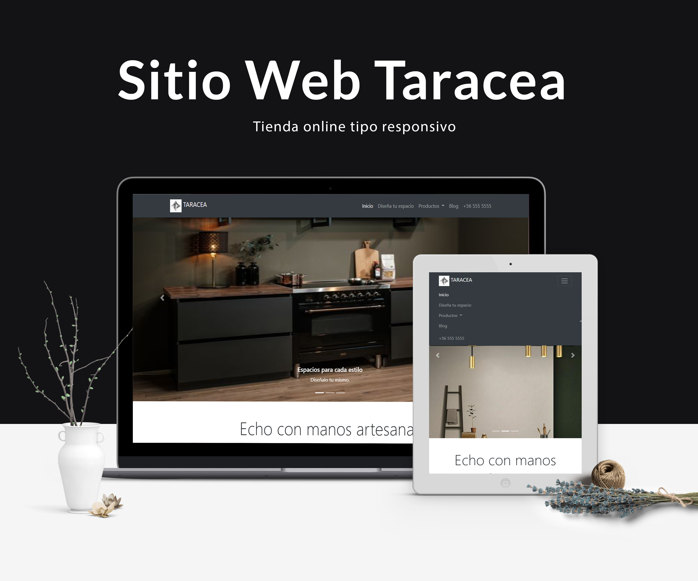
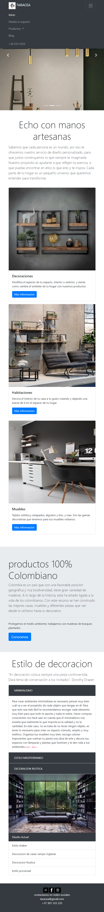
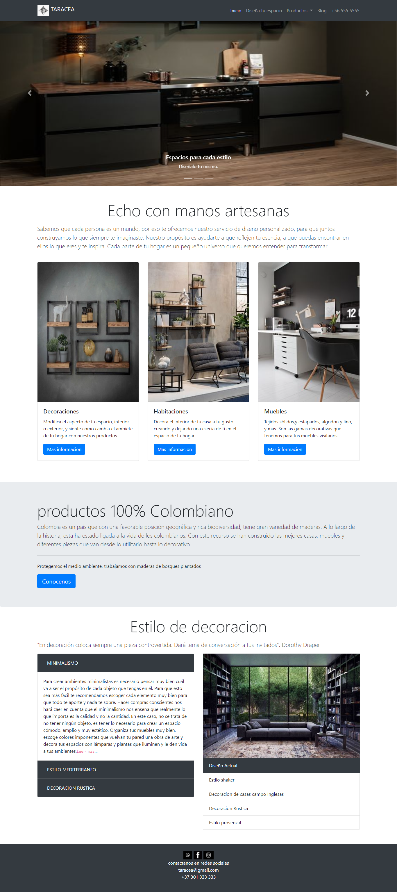

# Taracea-sitio-web

Este proyecto desarrolla un sitio web para una tienda online tipo responsivo manejado para las resoluciones de móvil y ordenador, en el proyecto se podrá visualizar la implementación de la biblioteca multiplataforma Bootstrap , con la aplicación de diferentes componentes como: Slider, cards y collapse con sus respectivas animaciones. Se manejan estilos tipográficos. Consta de un menú interactivo y un footer de contacto con redes sociales.

---

## Modelo Responsivo

## Movil Y Tablet

La resolución móvil y Tablet manejan un menú que se adecua al tamaño de estas resoluciones, para su diseño responsivo trabajamos con containers y la grid de bootstrap la cual nos ayuda a la distribución de los elementos para el manejo responsivo. 

## Ordenador

Para el manejo de la resolución del ordenador el nav-bar utilizado se adecúa al tamaño de la pantalla, además los elementos en vez de estar situados unos debajo del otro se reacomodan en el espacio dado para tener una mejor experiencia de usuario.

---
## Lenguajes Usados

|logo | lenguaje|
|-------|--------|
|   | BOOTSTRAP |
|   | CSS |
|   | Java |